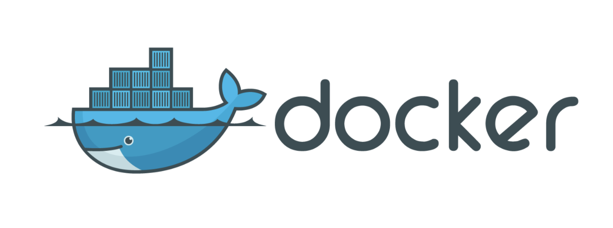
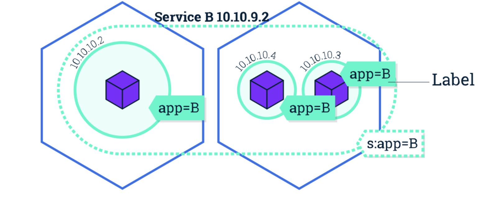

# Kubernetes介绍

## kubernetes的介绍-前世今生

我们通常把Kubernetes简称为K8S，Kubernetes名字太长了，叫起来有点麻烦，而Kubernetes首字母与结尾字母之间有8个字母，因此被称作K8S。但是其实老外并不明白！容器化的发展是计算机领域的必然结果，在传统部署服务和管理服务中，我们把更多的时间投入到了配置开发环境和部署应用上。大大影响了我们的效率，也增加了系统更多的不稳定性。所以这个时候容器时代就来了！

当然容器时代的最初的代表产物就是Docker！👀一下Docker可爱极了的样子。也就是👇的小鲸鱼。

当然在容器时代的初期，我们经常会使用DockerFile来构建docker，慢慢的我们发现了，我们突然有好多的DockerFile也有好多的Docker容器，并不容易管理。更不用说标准化了。所以，这个时候容器编排的概念和工具就慢慢的进入了我们的视角里。当然在编排出现的初期，有很多工具，比如：Docker Swarm、Kubernetes等，但是在发展的过程中Kubernetes已经成为了容器编排领域的一个标准了。

Kubernetes是Google团队发起的一个开源项目，他的目标就是管理多个跨主机的容器，用于自动化部署、扩展和管理容器化的应用程序，主要实现语言为Golang，它的理论基础来源于Google内部的Borg项目，所以Kubernetes项目要比其他开源项目“先进”很多，因为Borg系统一直被称为Google公司内部的“秘密武器”。

- 2014年6月 谷歌云计算专家埃里克·布鲁尔（Eric Brewer）在旧金山的发布会为这款新的开源工具揭牌。
- 2015年7月22日K8S迭代到 v 1.0并正式对外公布。
- 大约每100天更新一次，如今已是 V1.18版本。

## Kubernetes架构-整体结构

Kubernetes项目依托着Borg项目理论的优势,确定了一个如下图所示的全局架构图:

- Kubernetes属于主从分布式架构，主要由Master Node和Worker Node组成，以及包括客户端命令行工具kubectl和其它组件；

- Master Node：作为控制节点，对集群进行调度管理；

- Master Node由kube-apiserver、kube-scheduler和kube-controller-manager所组成；

- Worker Node：作为真正的工作节点，运行业务应用的容器；

- Worker Node包含kubelet、kube-proxy；

- kubectl：用于通过命令行与API Server进行交互，而对Kubernetes进行操作，实现在集群中进行各种资源的增删改查等操作；

## Kubernetes组件-细化分析

👆我们介绍了Kubernetes集群的整体架构，下面我们来更加详细的了解这些组件的功能。

### kube-apiserver [中央控制中心]

- APi Server提供了资源对象的唯一入口，其他所有组件必须通过它提供的API来操作资源数据。
- 只有API Server会与etcd进行通讯，其他模块都必须通过API Server访问集群状态。
- API Server封装了核心对象的增删改查操作，API Server以RESTFul接口规范提供服务。

以API Server为Kubernetes入口的设计主要有以下好处:

- 保证了集群状态访问的安全性。
- API Server隔离了集群状态访问和后端存储实现，这样将来不会因为后端存储技术Etcd的改变而导致要重构代码。

### kube-controller-manager [内部管理控制中心]

Controller Manager 用于实现Kubernetes集群故障检测和恢复的自动化工作。主要负责执行各种控制器：

- Replication Controller：主要是定期关联 Replication Controller (RC) 和 Pod，以保证集群中一个 RC (一种资源对象) 所关联的 Pod 副本数始终保持为与预设值一致。
- Node Controller：Kubelet 在启动时会通过 API Server 注册自身的节点信息，并定时向 API Server 汇报状态信息。API Server 在接收到信息后将信息更新到 Etcd 中。Node Controller 通过 API Server 实时获取 Node 的相关信息，实现管理和监控集群中的各个 Node 节点的相关控制功能。
- ResourceQuota Controller：资源配额管理控制器用于确保指定的资源对象在任何时候都不会超量占用系统上物理资源。
- Namespace Controller：用户通过 API Server 可以创建新的 Namespace 并保存在 Etcd 中，Namespace Controller 定时通过 API Server 读取这些 Namespace 信息来操作 Namespace。比如：Namespace 被 API 标记为优雅删除，则将该 Namespace 状态设置为 Terminating 并保存到 Etcd 中。同时 Namespace Controller 删除该 Namespace 下的 ServiceAccount、Deployment、Pod 等资源对象。
- Service Account Controller：服务账号控制器主要在命名空间内管理 ServiceAccount，以保证名为 default 的 ServiceAccount 在每个命名空间中存在。
- Token Controller：令牌控制器作为 Controller Manager 的一部分，主要用作：监听 serviceAccount 的创建和删除动作以及监听 secret 的添加、删除动作。
- Service Controller：服务控制器主要用作监听 Service 的变化。比如：创建的是一个 LoadBalancer 类型的 Service，Service Controller 则要确保外部的云平台上对该 Service 对应的 LoadBalancer 实例被创建、删除以及相应的路由转发表被更新。
- Endpoint Controller：Endpoints 表示了一个 Service 对应的所有 Pod 副本的访问地址，而 Endpoints Controller 是负责生成和维护所有 Endpoints 对象的控制器。Endpoint Controller 负责监听 Service 和对应的 Pod 副本的变化。定期关联 Service 和 Pod (关联信息由 Endpoint 对象维护)，以保证 Service 到 Pod 的映射总是最新的。

### kube-scheduler [资源分配中心]

Scheduler是负责整个集群的资源调度的。

- 主要用于收集当前集群中所有Node资源负载情况，然后依据资源使用情况，分发创建新的Pod到Kubernetes集群中可用节点。
- 在分发Pod到指定的节点以后，会把Pod相关的Binding信息写回API Server，以方便其他组件调用。
- 实时监测Kubernetes集群中未分发和已分发的所有Pod。
- 实时监测Node节点信息，由于会频繁查找 Node节点，所以 Scheduler同时会缓存一份最新的信息在本地。

### kubelet [节点管家]

Kubelet是负责容器真正运行的核心组件，维护容器的生命周期，并管理CSI（Container Storage Interface）和CNI（Conteinre Network Interface）。

- 负责Node节点上Pod的创建、修改、监控、删除等全生命周期的管理。
- 定时上报Node状态到API Server。
- kubelet是Master和Node之间的桥梁，接收API Server分配给它的任务并执行。
- kubelet通过API Server间接与Etcd集群交互来读取集群配置信息。

### kube-proxy [对外转发中心]

- kube-proxy是为了解决外部网络能访问到集群内部服务而设计的。
- kube-proxy运行在每个Node上。
- kube-proxy不但解决了统一宿主机相同服务端口冲突的问题，还提供了Service来实现转发服务端口对外提供服务的方式。
- kube-proxy后端一般分配是采用轮询方式。（当然有的时候测试会发现并不是轮询，这可能是由于Session Affinity会话亲和性导致的，当然这是采用iptables可能会出现的问题，我们一般会基于ipvs。具体也要看场景，当并发量超过一定量级iptables的性能会急剧下降，但是如果你的ops保证在某个量级区间的时候，iptables会比ipvs更好）。

### kubectl [集群管理命令行工具集]

- kubectl 是 Kubernetes 的 客户端的工具。

- 通过 kubectl 命令对 API Server 进行操作，API Server 响应并返回对应的命令结果，从而达到对 Kubernetes 集群的管理。

## Kubernetes核心资源对象-功能分析

上面我们都是在架构层面了解Kubernete，似乎我们根本没有提关于容器如何编排。这一小节，我们会分析Kubernetes是如何调度和统一管理这些容器的。(PS：容器就像你的小猫咪，总会偶尔调皮，但永远不会离开你)

### Pod - 小兵

啊？又是一个新的概念，什么是Pod呢？

- Pod是一组紧密关联的容器集合。
- 它们共享PID、IPC、Network和UTS namespace。
- 是Kubernetes调度的基本单元。

我猜一般人看了这些，应该还是不明白！没关系，我们继续唠！

Pod里面会包含一个或者N个容器，所以在 Kubernetes里面没有容器的概念，最小的调度单元就是Pod，所以我们将来部署任何服务都是基于Pod去调度的。当然上面也说了Pod里面可以放置多个容器或者1个容器，通常来说我们只会在一个Pod里面放一个容器。记住一个核心原则，将多个应用分散到多个Pod中，减少耦合性。

其实Pod在kubernetes中更重要的意义是容器的设计模式。所以技术不仅仅是技术更像是一种模式思想在领着我们一点一点往前走。

典型创建Pod的流程:

- 用户通过REST API创建一个Pod；
- apiserver将其写入etcd；
- scheduler检测到未绑定Node的Pod，开始调度并更新Pod的Node绑定；
- kubelet检测到有新的Pod调度过来，通过container runtime运行该Pod；
- kubelet通过container runtime取到Pod状态，并更新到apiserver中；

### Label - 特殊能力标记者

字如其名Label就是标签的意思，在Kubernetes资源对象中使用的巨多！也是非常重要的一个属性。

- Label是识别Kubernetes对象的标签，以`key/value`的方式附加到对象上。
- Label不提供唯一性，并且实际上经常是很多对象（如Pods）都会使用相同的Label来表示具体的应用，比如我们可以给一组nginx应用打一个标签为 `app=nginx`，app就是key，nginx就是value。
- Label定义好以后，其他对象可以使用Label Selector来选择一组相同的Label对象。比如，我们要创建一个Service那么就要选择对应的Pod，这个时候就可以使用Label Selector。

### Namespace - 资源隔离者

Namespace中文解释命名空间，是对一组资源和对象的抽象集合。

要听大白话？好！你可以认为namespaces是你kubernetes集群中的虚拟化集群。在一个Kubernetes集群中可以拥有多个命名空间，它们在逻辑上彼此隔离。 他们可以为您和您的团队提供组织，安全甚至性能方面的帮助！

> 注意它并不是 Linux Namespace，二者没有任何关系。

### Deployment - 无状态应用守护者

我们前面说了Pod是Kubernetes集群中的最基本调度单元，但是如果想要创建同一个Pod的多份备用或者负载均衡应用，需要一个一个分别创建出来么？是否需要将Pods划分到一个逻辑组里面来统一管理呢？那么Deployment就是用来管理Pod的资源对象。

举个栗子!

Deployment 确保任意时间都有指定数量的 Pod“副本”在运行。如果为某个 Pod 创建了 Deployment 并且指定3个副本，它会创建3个 Pod，并且持续监控它们。如果某个 Pod 不响应，那么 Deployment 会替换它，始终保持总数为3。

### Service

Service是应用服务的抽象，通过Label Selector为应用提供`负载均衡和服务发现`。

匹配Labels的Pod IP和端口会组成一个列表叫做`Endpoints`，由kube-proxy负责将服务IP负载均衡到这些Endpoints上。

每个Service都会自动分配一个Cluster IP（只能在集群内部访问的虚拟地址）和DNS名，其它Pod里的容器可以通过该地址或DNS来访问服务，而不需要了解后端Pod里容器的运行。

**第一篇文章，到这里就结束了，回顾一下，这篇文章我们主要是学习了Kubernetes的介绍、Kubernetes的架构、Kubernetes的组件和Kubernetes核心资源对象，这节概念比较多，所以希望大家好好理解，后面我们会详细把每个点展开在细讲和实践。下一篇文章：Kubernetes部署-摸一摸朋友吧。**