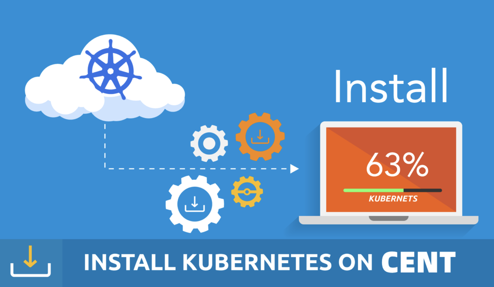
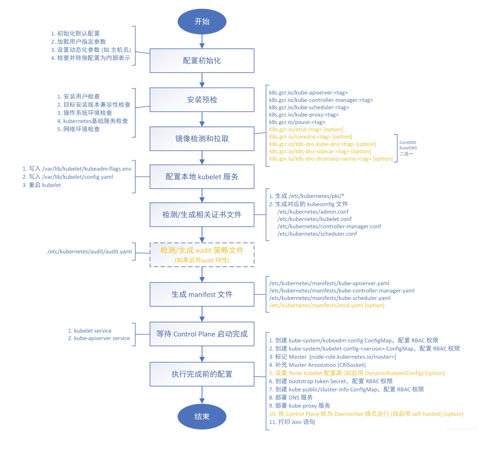
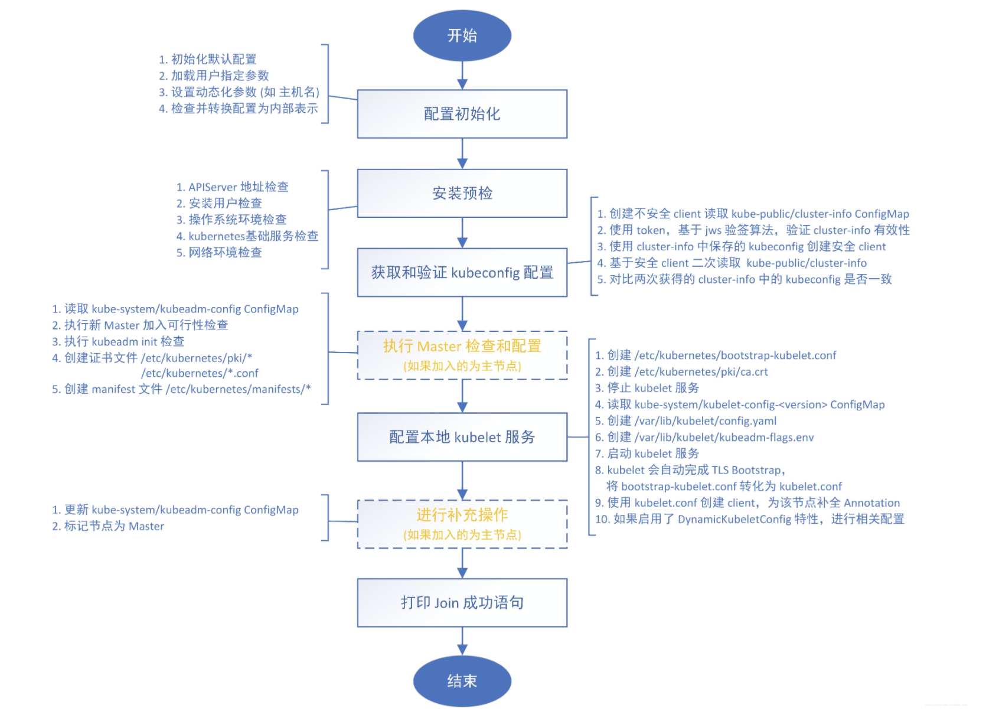

# Kubernetes部署


## kubernetes集群部署介绍 - kubeadm

截止到2020.04.08我们的生产环境还是`V1.15.3`，但这里我们使用比较新的`V1.16.2`版本，如果你是准备在生产环境中搭建集群，建议使用上一个版本的最大修正版`V1.15.5`，由于`V1.16.2`版本和之前的有比较大的变化，主要体现了一些APIVersion的版本变化，所以我们采用`V1.16.2`。

因为我们现在的目标是学习Kubernetes的知识点，所以我们选择kubeadm单点的方式部署。后面我们会单独讲kubeadm高可用的方案。

有些小伙伴会问！kubeadm现在可以上生产吗？我负责任的告诉你，完全可以！我们生产节点6个区域总worker数量 650+。




## kubernetes集群部署环境准备

我们使用3个节点，都是Centos 7.7系统，内核版本：3.10.0-1062.el7.x86_64

**每个节点做好hosts解析信息：**

```bash
[root@k8s-master-1 ~]# cat /etc/hosts
192.168.31.210 k8s-master-1
192.168.31.211 k8s-worker-1
192.168.31.212 k8s-worker-2
```

**每个节点禁用防火墙：**

```bash
[root@k8s-master-1 ~]# systemctl stop firewalld ; systemctl disable firewalld
```

**每个节点禁用Selinux：**

```bash
[root@k8s-master-1 ~]# setenforce 0
[root@k8s-master-1 ~]# cat /etc/selinux/config
SELINUX=disabled
```

**由于开启内核 ipv4 转发需要加载 br_netfilter 模块，所以每个节点加载该模块：**

```bash
[root@k8s-master-1 ~]# modprobe br_netfilter
```

**每个节点启动部分内核模块：**

```bash
[root@k8s-master-1 ~]# cat > /etc/sysctl.d/k8s.conf <<EOF
net.bridge.bridge-nf-call-ip6tables = 1
net.bridge.bridge-nf-call-iptables = 1
net.ipv4.ip_nonlocal_bind = 1
net.ipv4.ip_forward = 1
vm.swappiness=0
vm.max_map_count=655360
fs.file-max=1000000
net.ipv4.neigh.default.gc_thresh1=1024
net.ipv4.neigh.default.gc_thresh2=4096
net.ipv4.neigh.default.gc_thresh3=8192
net.core.netdev_max_backlog=10000
fs.inotify.max_user_instances=524288
fs.inotify.max_user_watches=524288
EOF
```

**每个节点刷新内核参数，使其生效：**

```bash
[root@k8s-master-1 ~]# sysctl -p /etc/sysctl.d/k8s.conf
```

**每个节点加载ipvs模块：**

```bash
[root@k8s-master-1 ~]# cat > /etc/sysconfig/modules/ipvs.modules <<EOF
#!/bin/bash
modprobe -- ip_vs
modprobe -- ip_vs_rr
modprobe -- ip_vs_wrr
modprobe -- ip_vs_sh
modprobe -- nf_conntrack_ipv4
EOF
[root@k8s-master-1 ~]# chmod 755 /etc/sysconfig/modules/ipvs.modules && bash /etc/sysconfig/modules/ipvs.modules && lsmod | grep -e ip_vs -e nf_conntrack_ipv4
```

> 可以使用 `lsmod | grep -e ip_vs -e nf_conntrack_ipv4` 这个命令查看是否正确加载了所需要的内核模块。

**每个节点安装ipset软件包和ipvsadm管理工具：**

```bash
 [root@k8s-master-1 ~]# yum install ipset ipvsadm -y
```

**每个节点同步服务器时间：**

```bash
[root@k8s-master-1 ~]# yum install chrony -y
已加载插件：fastestmirror
Loading mirror speeds from cached hostfile
 * base: mirrors.huaweicloud.com
 * extras: mirrors.huaweicloud.com
 * updates: mirrors.huaweicloud.com
软件包 chrony-3.4-1.el7.x86_64 已安装并且是最新版本
无须任何处理
[root@k8s-master-1 ~]# systemctl enable chronyd
[root@k8s-master-1 ~]# systemctl start chronyd
[root@k8s-master-1 ~]# chronyc sources
210 Number of sources = 4
MS Name/IP address         Stratum Poll Reach LastRx Last sample
===============================================================================
^- customer-vpn-proxy01.zur>     2  10   325   43m    +52ms[  +52ms] +/-  205ms
^- h199-182-204-197.ip4.unm>     2  10    25   265    +23ms[  +23ms] +/-  114ms
^* 203.107.6.88                  2  10   377   459  -8899us[-8738us] +/-   33ms
^- SunSITE.icm.edu.pl            2  10   133   749    +32ms[  +32ms] +/-  232ms
```

**每个节点关闭swap分区：**

```bash
 [root@k8s-master-1 ~]# swapoff -a
```

> 修改`/etc/fstab`文件，注释掉 SWAP 的自动挂载，使用`free -m`确认 swap 已经关闭。

**每个节点安装Docker（这里推荐使用18.09版本，官方推荐的最新验证版本）：**

```bash
[root@k8s-master-1 ~]# yum install -y yum-utils \
  device-mapper-persistent-data \
  lvm2
[root@k8s-master-1 ~]# yum-config-manager \
    --add-repo \
    https://download.docker.com/linux/centos/docker-ce.repo
[root@k8s-master-1 ~]# yum install docker-ce-18.09.9 -y
```

**每个节点配置 Docker 镜像加速器：**

```bash
[root@k8s-master-1 ~]# mkdir -p /etc/docker  
[root@k8s-master-1 ~]# cat > /etc/docker/daemon.json <<EOF
{
  "exec-opts": ["native.cgroupdriver=systemd"],
  "registry-mirrors" : [
    "https://ot2k4d59.mirror.aliyuncs.com/"
  ]
}
EOF
```

> 由于默认情况下 kubelet 使用的 cgroupdriver 是 systemd，所以需要保持 docker 和kubelet 的 cgroupdriver 一致，我们这里修改 docker 的 cgroupdriver=systemd。如果不修改 docker 则需要修改 kubelet 的启动配置，需要保证两者一致。

**每个节点启动 Docker：**

```bash
[root@k8s-master-1 ~]# systemctl start docker ; systemctl enable docker
```

完成Docker的启动以后，我们的基础环境就配置完了，接下来我们要进入kubeadm的配置与部署Kubernetes集群的小节了。


## kubeadm kubelet kubectl安装

安装kubeadm、kubelet、kubectl

**每个节点配置yum源，来安装kubeadm等组件：**

```bash
[root@k8s-master-1 ~]# cat <<EOF > /etc/yum.repos.d/kubernetes.repo
[kubernetes]
name=Kubernetes
baseurl=http://mirrors.aliyun.com/kubernetes/yum/repos/kubernetes-el7-x86_64
enabled=1
gpgcheck=0
repo_gpgcheck=0
gpgkey=http://mirrors.aliyun.com/kubernetes/yum/doc/yum-key.gpg
        http://mirrors.aliyun.com/kubernetes/yum/doc/rpm-package-key.gpg
EOF
```

**每个节点安装kubeadm、kubelet、kubectl：**

```bash
[root@k8s-master-1 ~]# yum install -y kubelet-1.16.2 kubeadm-1.16.2 kubectl-1.16.2 --disableexcludes=kubernetes
[root@k8s-master-1 ~]# kubeadm version
kubeadm version: &version.Info{Major:"1", Minor:"16", GitVersion:"v1.16.2" ......
```

**每个节点将 kubelet 设置成开机启动：**

```bash
[root@k8s-master-1 ~]# systemctl enable --now kubelet
```


## Kubernetes集群初始化 - 部署Master节点

使用配置文件，通过kubeadm init指令初始化集群

**在master节点上配置kubeadm初始化文件，我们先导出默认的初始化配置：**

```bash
[root@k8s-master-1 ~]# kubeadm config print init-defaults > kubeadm.yaml
```

**根据我们自己的需求修改对应配置，比如修改`imageRepository`的值，kube-proxy为ipvs模式等等。这里我们把`networking.podSubnet`设置为`10.244.0.0/16`，因为后面我要使用flannel网络插件的：**

```bash
apiVersion: kubeadm.k8s.io/v1beta2
bootstrapTokens:
- groups:
  - system:bootstrappers:kubeadm:default-node-token
  token: abcdef.0123456789abcdef
  ttl: 24h0m0s
  usages:
  - signing
  - authentication
kind: InitConfiguration
localAPIEndpoint:
  advertiseAddress: 192.168.31.210   # 填写master节点的内网ip地址
  bindPort: 6443
nodeRegistration:
  criSocket: /var/run/dockershim.sock
  name: k8s-master-1   # 填写master节点的hostname  默认会读取不需要改动
  taints:
  - effect: NoSchedule
    key: node-role.kubernetes.io/master
---
apiServer:
  timeoutForControlPlane: 4m0s
apiVersion: kubeadm.k8s.io/v1beta2
certificatesDir: /etc/kubernetes/pki
clusterName: kubernetes
controllerManager: {}
dns:
  type: CoreDNS
etcd:
  local:
    dataDir: /var/lib/etcd
imageRepository: gcr.azk8s.cn/google_containers  # 修改成微软镜像源,如果使用不了看下面的解决方案。 
kind: ClusterConfiguration
kubernetesVersion: v1.16.2  # 指定版本号
networking:
  dnsDomain: cluster.local
  podSubnet: 10.244.0.0/16  # Pod 网段，flannel插件需要使用这个网段
  serviceSubnet: 10.96.0.0/12
scheduler: {}
---
apiVersion: kubeproxy.config.k8s.io/v1alpha1
kind: KubeProxyConfiguration
mode: ipvs  # kube-proxy 模式
```

> 对于资源配置的文档比较多，想要了解完整的资源对象对应的属性，可以查看官方的godoc文档：
>
> https://pkg.go.dev/k8s.io/kubernetes/cmd/kubeadm/app/apis/kubeadm/v1beta2?tab=doc
>
> 有的时候微软镜像源使用不了，也不能翻墙。
>
> ~~imageRepository: gcr.azk8s.cn/google_containers~~ 
>
> 请使用我的镜像hub下载，更改配置文件里面的镜像源即可：
>
> imageRepository:  docker.io/heyangguang123
>

**使用配置文件，初始化Kubernetes集群：**

```yaml
[root@k8s-master-1 ~]# kubeadm init --config kubeadm.yaml
[init] Using Kubernetes version: v1.16.2
[preflight] Running pre-flight checks
[preflight] Pulling images required for setting up a Kubernetes cluster
[preflight] This might take a minute or two, depending on the speed of your internet connection
[preflight] You can also perform this action in beforehand using 'kubeadm config images pull'
[kubelet-start] Writing kubelet environment file with flags to file "/var/lib/kubelet/kubeadm-flags.env"
[kubelet-start] Writing kubelet configuration to file "/var/lib/kubelet/config.yaml"
[kubelet-start] Activating the kubelet service
[certs] Using certificateDir folder "/etc/kubernetes/pki"
[certs] Generating "ca" certificate and key
[certs] Generating "apiserver" certificate and key
[certs] apiserver serving cert is signed for DNS names [k8s-master-1 kubernetes kubernetes.default kubernetes.default.svc kubernetes.default.svc.cluster.local] and IPs [10.96.0.1 192.168.31.210]
[certs] Generating "apiserver-kubelet-client" certificate and key
[certs] Generating "front-proxy-ca" certificate and key
[certs] Generating "front-proxy-client" certificate and key
[certs] Generating "etcd/ca" certificate and key
[certs] Generating "etcd/server" certificate and key
[certs] etcd/server serving cert is signed for DNS names [k8s-master-1 localhost] and IPs [192.168.31.210 127.0.0.1 ::1]
[certs] Generating "etcd/peer" certificate and key
[certs] etcd/peer serving cert is signed for DNS names [k8s-master-1 localhost] and IPs [192.168.31.210 127.0.0.1 ::1]
[certs] Generating "etcd/healthcheck-client" certificate and key
[certs] Generating "apiserver-etcd-client" certificate and key
[certs] Generating "sa" key and public key
[kubeconfig] Using kubeconfig folder "/etc/kubernetes"
[kubeconfig] Writing "admin.conf" kubeconfig file
[kubeconfig] Writing "kubelet.conf" kubeconfig file
[kubeconfig] Writing "controller-manager.conf" kubeconfig file
[kubeconfig] Writing "scheduler.conf" kubeconfig file
[control-plane] Using manifest folder "/etc/kubernetes/manifests"
[control-plane] Creating static Pod manifest for "kube-apiserver"
[control-plane] Creating static Pod manifest for "kube-controller-manager"
[control-plane] Creating static Pod manifest for "kube-scheduler"
[etcd] Creating static Pod manifest for local etcd in "/etc/kubernetes/manifests"
[wait-control-plane] Waiting for the kubelet to boot up the control plane as static Pods from directory "/etc/kubernetes/manifests". This can take up to 4m0s
[apiclient] All control plane components are healthy after 34.507583 seconds
[upload-config] Storing the configuration used in ConfigMap "kubeadm-config" in the "kube-system" Namespace
[kubelet] Creating a ConfigMap "kubelet-config-1.16" in namespace kube-system with the configuration for the kubelets in the cluster
[upload-certs] Skipping phase. Please see --upload-certs
[mark-control-plane] Marking the node k8s-master-1 as control-plane by adding the label "node-role.kubernetes.io/master=''"
[mark-control-plane] Marking the node k8s-master-1 as control-plane by adding the taints [node-role.kubernetes.io/master:NoSchedule]
[bootstrap-token] Using token: abcdef.0123456789abcdef
[bootstrap-token] Configuring bootstrap tokens, cluster-info ConfigMap, RBAC Roles
[bootstrap-token] configured RBAC rules to allow Node Bootstrap tokens to post CSRs in order for nodes to get long term certificate credentials
[bootstrap-token] configured RBAC rules to allow the csrapprover controller automatically approve CSRs from a Node Bootstrap Token
[bootstrap-token] configured RBAC rules to allow certificate rotation for all node client certificates in the cluster
[bootstrap-token] Creating the "cluster-info" ConfigMap in the "kube-public" namespace
[addons] Applied essential addon: CoreDNS
[addons] Applied essential addon: kube-proxy

Your Kubernetes control-plane has initialized successfully!

To start using your cluster, you need to run the following as a regular user:

  mkdir -p $HOME/.kube
  sudo cp -i /etc/kubernetes/admin.conf $HOME/.kube/config
  sudo chown $(id -u):$(id -g) $HOME/.kube/config

You should now deploy a pod network to the cluster.
Run "kubectl apply -f [podnetwork].yaml" with one of the options listed at:
  https://kubernetes.io/docs/concepts/cluster-administration/addons/

Then you can join any number of worker nodes by running the following on each as root:

kubeadm join 192.168.31.210:6443 --token abcdef.0123456789abcdef \
    --discovery-token-ca-cert-hash sha256:a45c5128092c4dca29196f12f73982c4f01b67ddccd26bea48faf76df62d802d
```

**拷贝kubeconfig文件：**

```bash
[root@k8s-master-1 ~]# mkdir -p $HOME/.kube
[root@k8s-master-1 ~]# sudo cp -i /etc/kubernetes/admin.conf $HOME/.kube/config
[root@k8s-master-1 ~]# sudo chown $(id -u):$(id -g) $HOME/.kube/config
```


## kubeadm init 做了哪些事情呢？




## Kubernetes集群节点添加 - 部署Worker节点

根据我们初始化集群完成后的提示，使用join命令即可

**使用Join命令添加Worker节点（在worker-1和worker-2上执行）：**

```bash
[root@k8s-worker-1 ~]# kubeadm join 192.168.31.210:6443 --token abcdef.0123456789abcdef \
>     --discovery-token-ca-cert-hash sha256:a45c5128092c4dca29196f12f73982c4f01b67ddccd26bea48faf76df62d802d
[preflight] Running pre-flight checks
[preflight] Reading configuration from the cluster...
[preflight] FYI: You can look at this config file with 'kubectl -n kube-system get cm kubeadm-config -oyaml'
[kubelet-start] Downloading configuration for the kubelet from the "kubelet-config-1.16" ConfigMap in the kube-system namespace
[kubelet-start] Writing kubelet configuration to file "/var/lib/kubelet/config.yaml"
[kubelet-start] Writing kubelet environment file with flags to file "/var/lib/kubelet/kubeadm-flags.env"
[kubelet-start] Activating the kubelet service
[kubelet-start] Waiting for the kubelet to perform the TLS Bootstrap...

This node has joined the cluster:
* Certificate signing request was sent to apiserver and a response was received.
* The Kubelet was informed of the new secure connection details.

Run 'kubectl get nodes' on the control-plane to see this node join the cluster.   


[root@k8s-worker-2 ~]# kubeadm join 192.168.31.210:6443 --token abcdef.0123456789abcdef \
>     --discovery-token-ca-cert-hash sha256:a45c5128092c4dca29196f12f73982c4f01b67ddccd26bea48faf76df62d802d
[preflight] Running pre-flight checks
[preflight] Reading configuration from the cluster...
[preflight] FYI: You can look at this config file with 'kubectl -n kube-system get cm kubeadm-config -oyaml'
[kubelet-start] Downloading configuration for the kubelet from the "kubelet-config-1.16" ConfigMap in the kube-system namespace
[kubelet-start] Writing kubelet configuration to file "/var/lib/kubelet/config.yaml"
[kubelet-start] Writing kubelet environment file with flags to file "/var/lib/kubelet/kubeadm-flags.env"
[kubelet-start] Activating the kubelet service
[kubelet-start] Waiting for the kubelet to perform the TLS Bootstrap...

This node has joined the cluster:
* Certificate signing request was sent to apiserver and a response was received.
* The Kubelet was informed of the new secure connection details.

Run 'kubectl get nodes' on the control-plane to see this node join the cluster.
```

> 如果忘记了上面的 join 命令可以使用命令 `kubeadm token create --print-join-command` 重新获取。
>
> 注意：初始化的join token只有2个小时有效期，过期了请使用上面命令重新获取！

**查看当前集群节点信息（在Master节点上执行，NotReady状态是正常的！）：**

```bash
[root@k8s-master-1 ~]# kubectl get nodes
NAME           STATUS     ROLES    AGE     VERSION
k8s-master-1   NotReady   master   2m42s   v1.16.2
k8s-worker-1   NotReady   <none>   51s     v1.16.2
k8s-worker-2   NotReady   <none>   50s     v1.16.2
```


## kubeadm join 又是如何进行的呢？




## 部署网络插件Flannel

部署网络插件flannel

**到这里的，会发现我们现在集群的状态都是NotReady状态，不要惊慌！基本操作！这是因为还没有安装网络查件导致的，接下来我们部署Flannel网络插件（Master节点上执行）：**

```bash
# 下载网络插件部署的yaml，需要翻墙，如果不能翻墙的，请点击下面的github下载。
# https://github.com/heyangguang/kubernetes-doc/blob/master/yaml/02-install-k8s/kube-flannel.yml
[root@k8s-master-1 ~]# wget https://raw.githubusercontent.com/coreos/flannel/2140ac876ef134e0ed5af15c65e414cf26827915/Documentation/kube-flannel.yml

# 因为有节点是多网卡，所以需要在资源清单文件中指定内网网卡
# 搜索到名为 kube-flannel-ds-amd64 的 DaemonSet，在kube-flannel容器下面
[root@k8s-master-1 ~]# vim kube-flannel.yml
......
initContainers:
      - name: install-cni
        image: heyangguang123/flannel:v0.11.0-amd64 # 更改镜像地址
        command:
        - cp
        args:
        - -f
        - /etc/kube-flannel/cni-conf.json
        - /etc/cni/net.d/10-flannel.conflist
        volumeMounts:
        - name: cni
          mountPath: /etc/cni/net.d
        - name: flannel-cfg
          mountPath: /etc/kube-flannel/
      containers:
      - name: kube-flannel
        image: heyangguang123/flannel:v0.11.0-amd64 # 更改镜像地址
        command:
        - /opt/bin/flanneld
        args:
        - --ip-masq
        - --kube-subnet-mgr
        - --iface=ens33  # 指定内网网卡的名称
......

# 部署 flannel 网络插件
[root@k8s-master-1 ~]# kubectl apply -f kube-flannel.yml  
```

> 网络插件很多，可以在这个链接中选择网络插件：
>
> https://kubernetes.io/docs/setup/production-environment/tools/kubeadm/create-cluster-kubeadm/ 

**等一会，查看Pod的运行状态：**

```bash
[root@k8s-master-1 ~]# kubectl get pods -n kube-system
NAME                                   READY   STATUS    RESTARTS   AGE
coredns-5fbf5bb7b4-b6hvr               1/1     Running   0          14m
coredns-5fbf5bb7b4-c8tpg               1/1     Running   0          14m
etcd-k8s-master-1                      1/1     Running   0          13m
kube-apiserver-k8s-master-1            1/1     Running   0          13m
kube-controller-manager-k8s-master-1   1/1     Running   0          13m
kube-flannel-ds-amd64-9rndl            1/1     Running   0          2m13s
kube-flannel-ds-amd64-v7jkk            1/1     Running   0          2m13s
kube-flannel-ds-amd64-zgt6j            1/1     Running   0          2m13s
kube-proxy-6m2lv                       1/1     Running   0          12m
kube-proxy-nxxlj                       1/1     Running   0          12m
kube-proxy-xjxxp                       1/1     Running   0          14m
kube-scheduler-k8s-master-1            1/1     Running   0          13m
```

**都是Running以后，我们查看node状态：**

```bash
[root@k8s-master-1 ~]# kubectl get nodes
NAME           STATUS   ROLES    AGE   VERSION
k8s-master-1   Ready    master   14m   v1.16.2
k8s-worker-1   Ready    <none>   12m   v1.16.2
k8s-worker-2   Ready    <none>   12m   v1.16.2
```


**本篇文章，到这里就结束了，回顾一下，这篇文章我们主要是学习了基础环境的搭建、Kubernetes的部署、kubeadm的init join流程、Flannel网络插件的部署。下一篇文章：Kubernetes Dashboard-给朋友穿上一件酷酷的外套。**