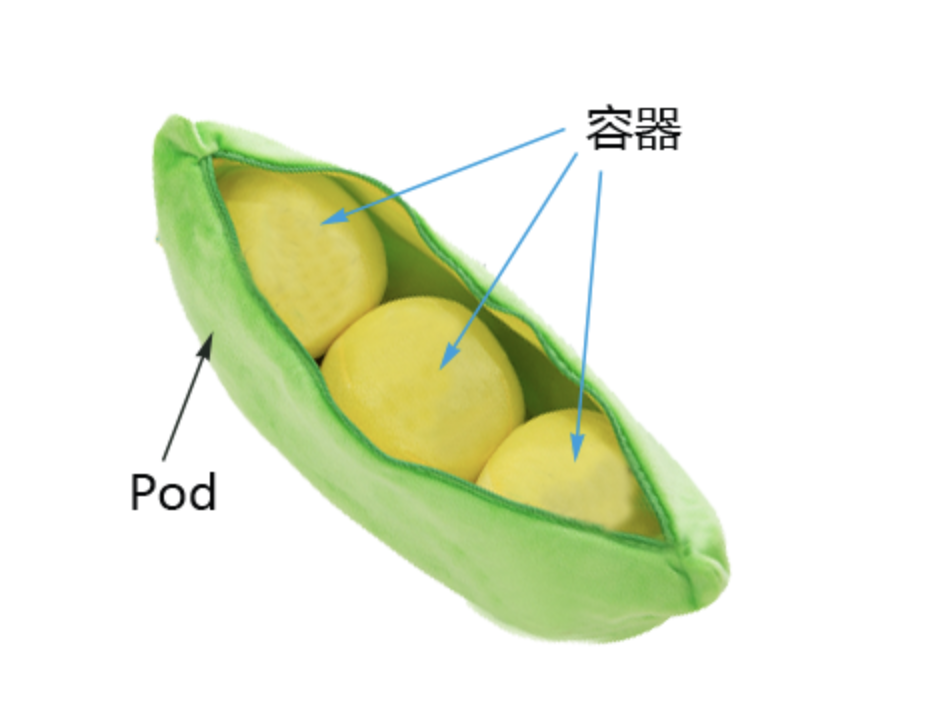
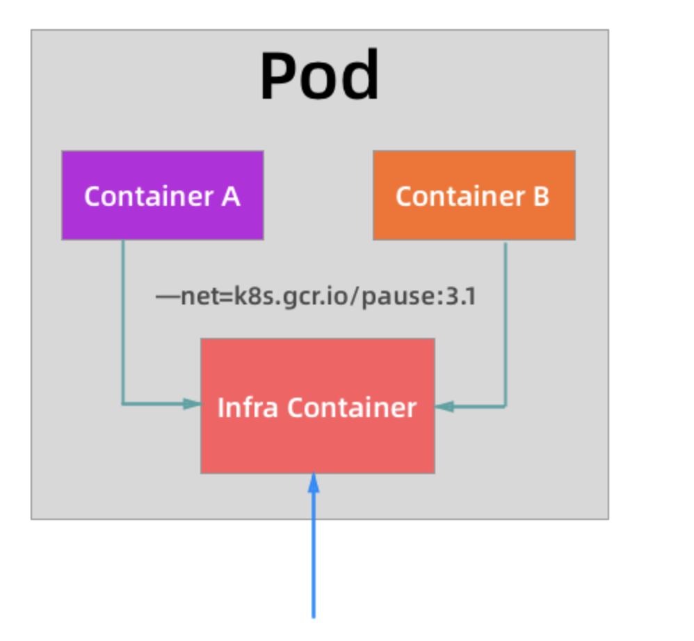
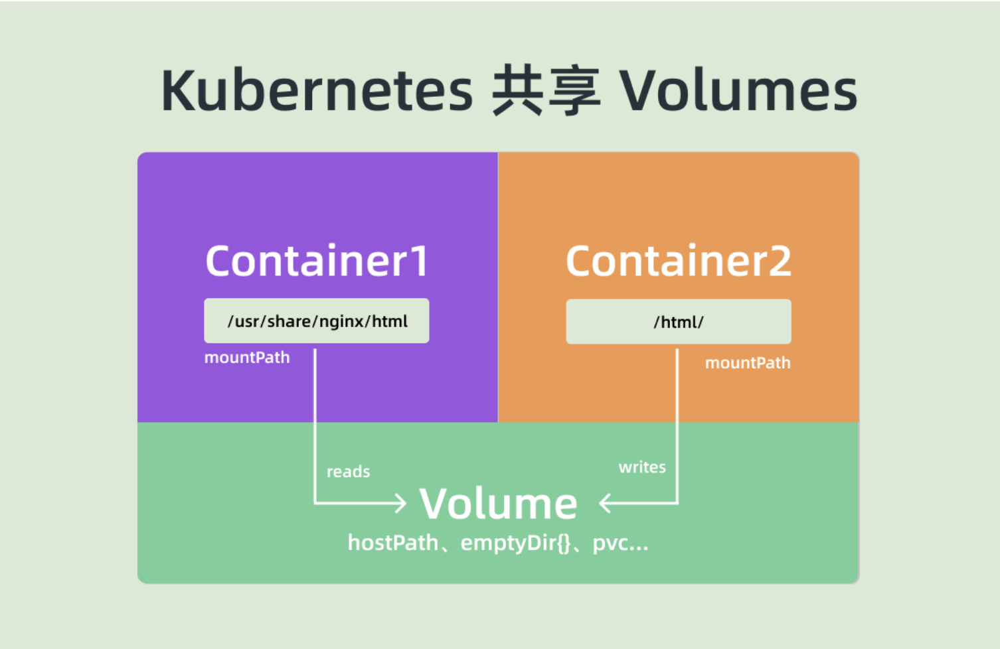
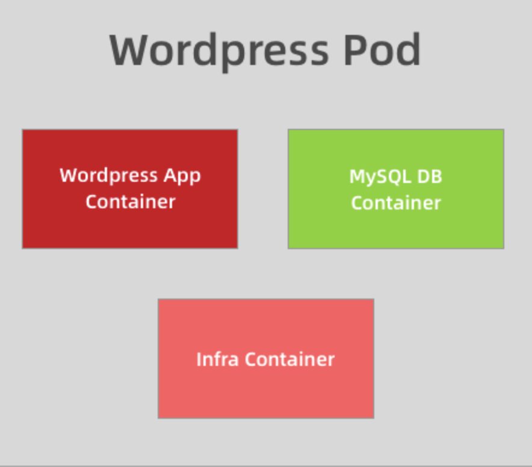
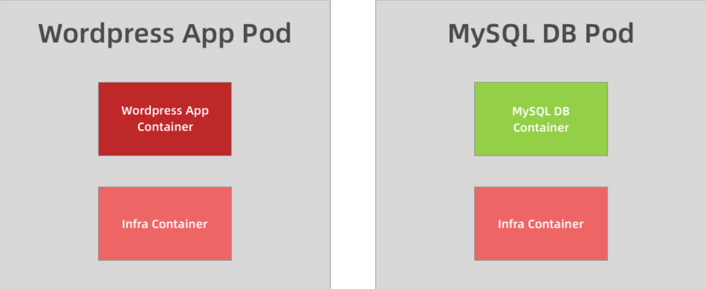

# Kubernetes Pod原理

Pod-Kubernetes的最基本调度单元



前面我们学了Kubernetes的基本架构，我们也了解了Pod是Kubernetes中最基本的调度单元，我们平时在集群中部署的应用都是以Pod为单位的，而并不是容器，这样的设计目的是什么呢？为何不直接使用容器呢？这章节我将带领大家一起探索。


## 为什么需要Pod

架设Kubernetes中调度的基本单元是容器，对于一个非常简单的应用可以直接被调度，没有什么问题，但是往往还有很多应用是由多个进程组成的。有的小伙伴会说把这些进程都打包到一个容器中去不就可以了吗？理论上是可以实现的。但是不要忘记了Docker管理的进程是pid=1的主进程，其他进程死掉了就会变成僵尸进程，没办法进行管理了，这种方式也不是容器思想推荐的方式，一个容器最好只做一件事情，所以我们在生产中并不会使用这种方式。

那么我们把这个应用的进程进行拆分，拆分成一个一个的容器总可以了吧？但是不要忘记了一个问题，拆分成一个一个的容器后，是不是就有可能出现一个应用下面的某个进程容器被调度到了不通的节点上？往往我们应用内部的进程与进程间通讯（通过IPC或者共享本地文件之类）都是要去在本地进行的。

所以我们需要一个更高级别的结构来将这些容器绑定在一起，并将它们作为一个基本的调度单元进行管理，这样就可以保证这些容器始终在同一个节点上面，这也就是Pod设计的初衷。


## Pod原理

在一个Pod下面运行几个关系非常密切的容器进程，这样就解决了我们上面提出的问题。

其实Pod一直都是一个逻辑的概念，一种思想，真正起作用的还是Linux容器的Namespace和Cgroup这两个最基本的概念，Pod被创建出来其实是一组共享了一些资源的容器而已。首先Pod里面的所有容器，都是共享一个Network Namespace，但是涉及到文件系统的时候，默认情况下Pod里面的容器之间的文件系统是完全隔离的，但是我们可以通过一个声明来共享同一个Volume。


## 如何实现共享Network Namespace呢？

我们来讲讲如何共享一个Network Namespace呢。了解Docker网络模式的小伙伴应该知道网络的Container模式。我们可以在指定创建的容器和一个已经存在的容器共享一个Network Namespace，在运行容器的时候指定`--net=container:目标容器名`这个参数就可以了。但是这种模式有一个明显的问题那就是容器的启动有先后顺序问题，那么Pod是怎么来处理这个问题的呢?那就是加入一个中间容器，这个容器就叫做`Infra`容器，而且这个容器在 Pod中永远都是第一个被创建的容器，这样是不是其他容器加入到这个`Infra`容器就可以了，这样就完全实现了Pod中的所有容器都和`Infra`容器共享一个Network Namespace了。




## Kubernetes创建一个Pod的时候`Infra`容器到底做了什么事情呢？

当我们部署完成Kubernetes集群的时候，首先需要保证在所有节点上可以拉取到默认的`Infra`镜像，默认情况下`Infra`镜像地址为`k8s.gcr.io/pause:3.1`，这个容器占用的资源非常小。

所以有小伙伴创建容器的时候会一直`Pending`状态，那很有可能是因为这个容器拉不下来导致的！

```bash
[root@k8s-master-1 ~]#  kubelet --help |grep infra
      --pod-infra-container-image string                                                                          The image whose network/ipc namespaces containers in each pod will use. This docker-specific flag only works when container-runtime is set to docker. (default "k8s.gcr.io/pause:3.1")
```

学习了上面的知识，小伙伴们就应该知道，所有普通的容器都会加入到`Infra`容器的Network  Namespace中，所以这个Pod下面的所有容器就是共享同一个Network Namespace了，普通容器不会创建自己的网卡，配置自己的IP，而是和`Infra`容器共享IP、端口等，而且容器之间的进程可以通过IO网卡设备进行通讯，总结一下：

- 同一个Pod容器之间是可以直接使用`localhost`进行通讯的。
- 同一个Pod容器的网络设备信息都是和`Infra`容器完全一致的。
- 同一个Pod下面的容器多个进程不能绑定相同的端口。
- Pod 的生命周期只跟 `Infra` 容器一致，而与容器 A 和 B 无关。


## Kubernetes如何共享文件系统呢？

对于文件系统Kubernetes是怎么实现让一个Pod中的容器共享呢？默认情况下容器的文件系统是相互隔离的，要实现共享只需要在Pod的顶层生命一个Volume，然后在需要共享这个Volume的容器中生命挂载即可。



写一个简单的示例：

```yaml
apiVersion: v1
kind: Pod
metadata:
  name: log
  labels:
    app: log
spec:
  volumes:
    - name: varlog
      hostPath:
        path: /var/log/testlog
  restartPolicy: Always
  containers:
    - name: log
      image: busybox
      args:
        - /bin/sh
        - -c
        - >
          i=0;
          while true;
          do
          echo "$i: $(date)" >> /var/log/1.log;
          i=$((i+1));
          sleep 1;
          done
      imagePullPolicy: IfNotPresent
      volumeMounts:
        - mountPath: /var/log
          name: varlog
    - name: log-tail
      image: busybox
      args: [/bin/sh, -c, 'tail -n+1 -f /var/log/1.log']
      volumeMounts:
        - mountPath:  /var/log
          name: varlog
```

在这个例子中，我们在Pod的顶层生命了一个名为 varlog的`Volume`，而这个`Volume`的类型是`hostPath`，也就意味着这个宿主的`/var/log/testlog`目录将被这个Pod共享，共享给谁呢？在需要用到这个数据目录的容器上生命挂载即可，也就是通过`volumeMounts`声明挂载部分，这样我们就实现了共享容器的`/var/log`目录，而且数据被持久化到了宿主机的目录上。


## sidecar模式是什么？

我们上面实现容器共享文件系统其实是Kubernetes中一个非常重要的设计模式：`sidecar`模式常用的方式。典型的业务场景就是容器的日志收集。比如上面我们的这个应用，其中应用的日志是被输出到容器的 /var/log 目录上的，这个时候我们可以把 Pod 声明的 Volume 挂载到容器的 /var/log 目录上，然后在这个 Pod 里面同时运行一个 sidecar 容器，也声明挂载相同的 Volume 到自己容器的 /var/log （或其他）目录上，这样我们这个 sidecar 容器就只需要从 /var/log 目录下面不断消费日志发送到 Elasticsearch 中存储起来就完成了最基本的应用日志的基本收集工作了。

除了这个应用场景之外使用更多的还是利用 Pod 中的所有容器共享同一个 Network Namespace 这个特性，这样我们就可以把 Pod 网络相关的配置和管理也可以交给一个 sidecar 容器来完成，完全不需要去干涉用户容器，这个特性在现在非常火热的 Service Mesh（服务网格）中应用非常广泛，典型的应用就是 [Istio](https://istio.io/)。


## 如何优雅的把应用划分为不同的Pod？

上面我们介绍了Pod的实现原理，了解了应用把关系紧密的容器划分到同一个Pod中运行，那么怎么来区分“关系紧密”呢？举一个简单的示例，比如我们的 Wordpress + MySQL应用，是一个典型的前端服务器和后端数据服务的应用，那么你认为应该使用一个 Pod 还是两个 Pod 呢？

如果在同一个 Pod 中同时运行服务器程序和后端的数据库服务这两个容器，理论上肯定是可行的，但是不推荐这样使用，我们知道一个 Pod 中的所有容器都是同一个整体进行调度的，但是对于我们这个应用 Wordpress 和 MySQL 数据库一定需要运行在一起吗？当然不需要，我们甚至可以将 MySQL 部署到集群之外对吧？所以 Wordpress 和 MySQL 即使不运行在同一个节点上也是可行的，只要能够访问到即可。



但是如果你非要强行部署到同一个 Pod 中呢？从某个角度来说是错误的，比如现在我们的应用访问量非常大，一个 Pod 已经满足不了我们的需求了，怎么办呢？扩容对吧，但是扩容的目标也是 Pod，并不是容器，比如我们再添加一个 Pod，这个时候我们就有两个 Wordpress 的应用和两个 MySQL 数据库了，而且这两个 Pod 之间的数据是互相独立的，因为 MySQL 数据库并不是简单的增加副本就可以共享数据了，所以这个时候就得分开部署了，采用第二种方案，这个时候我们只需要单独扩容 Wordpress 的这个 Pod，后端的 MySQL 数据库并不会受到扩容的影响。



将多个容器部署到同一个 Pod 中的最主要参考就是应用可能由一个主进程和一个或多个的辅助进程组成，比如上面我们的日志收集的 Pod，需要其他的 sidecar 容器来支持日志的采集。所以当我们判断是否需要在 Pod 中使用多个容器的时候，我们可以按照如下的几个方式来判断：

- 这些容器是否一定需要一起运行，是否可以运行在不同的节点上。
- 这些容器是一个整体还是独立的组件。
- 这些容器一起进行扩缩容会影响应用吗。

基本上我们能够回答上面的几个问题就能够判断是否需要在 Pod 中运行多个容器了。


**本篇文章，到这里就结束了，回顾一下，这篇文章我们主要是学习了Kubernetes Pod原理、如何实现共享Network Namespace、`Infra`容器，sidecar模式，划分Pod的艺术。下一篇文章：Kubernetes Pod生命周期管理。**

